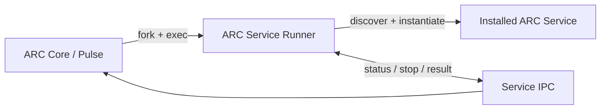
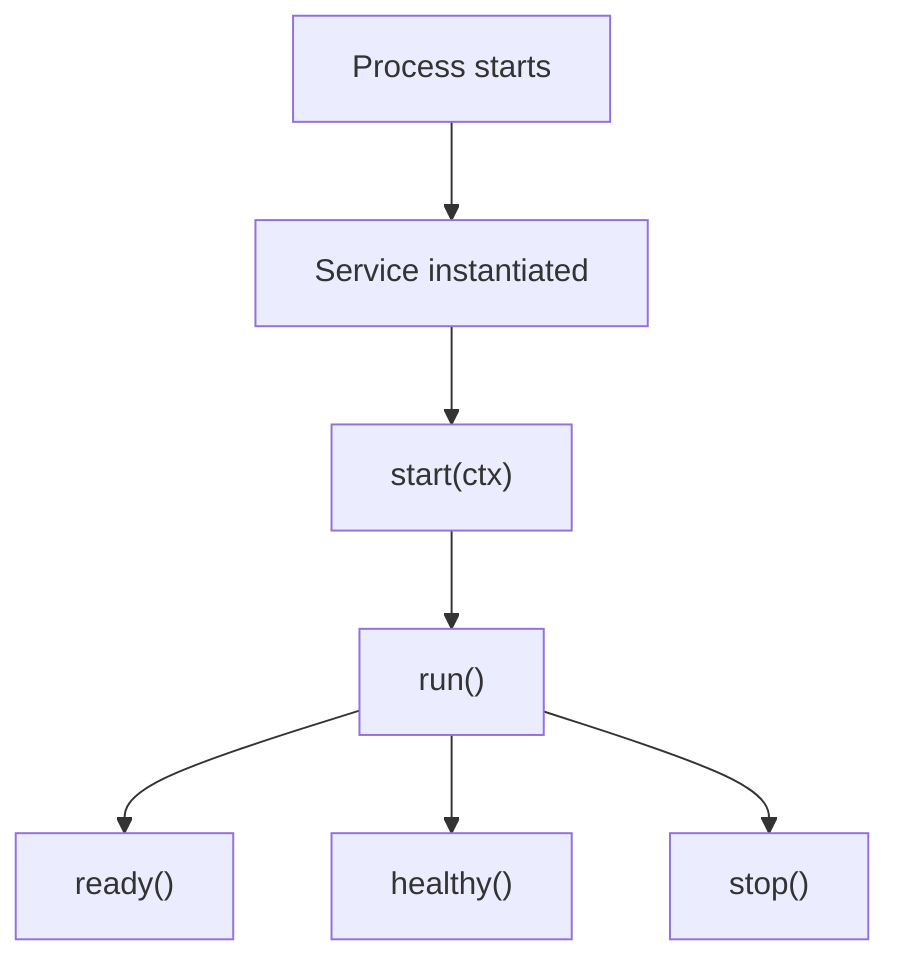

# ARC V2 Service Runner

> Runtime contract and process runner for independently installable ARC V2 services.

[](https://github.com/PauWol)
[](https://www.python.org/)
[](#license)

## Overview

`arc-v2-service-runner` provides the small runtime layer required for an ARC V2 service to run as an independently installed, Pulse-managed process.

It defines the stable service API shared by ARC services and provides the generic runner used by ARC Core to start them inside the ARC service runtime environment.



## Responsibilities

The package provides:

* `Service` — base contract every ARC service implements
* `BaseContext` — runtime context injected into services
* `ServiceStatus` — readiness and health reporting
* `ProcessResult` — service process outcome reporting
* `ProcessOutcome` — standardized process termination states
* `ServiceState` — shared lifecycle states
* `runner` — generic service process entry point

It does **not** install, configure, or supervise services. Those responsibilities belong to ARC Core and Pulse.

## Service API

Every ARC service inherits from `Service`:

```python
from arc_service import Service


class TestService(Service):
    def __init__(self) -> None:
        super().__init__(
            name="test",
            version="0.1.0",
            description="ARC test service",
        )

    async def run(self) -> None:
        assert self.ctx is not None

        self.ctx.logger.info("Service started")

        while True:
            await asyncio.sleep(1)

    async def ready(self) -> tuple[bool, str | None]:
        return True, None

    async def healthy(self) -> tuple[bool, str | None]:
        return True, None

    async def stop(self) -> None:
        ...
```

The service lifecycle is:



`start()` is provided by the framework and should not be overridden.

## Runtime Context

Services receive a `BaseContext`:

```python
@dataclass(slots=True)
class BaseContext:
    logger: Logger
    env: Mapping[str, str]
    service_name: str
    process_name: str
```

Example:

```python
async def run(self) -> None:
    assert self.ctx is not None

    self.ctx.logger.info("Starting %s", self.ctx.service_name)

    model_path = self.ctx.env.get(
        "ARC_RUNTIME_MODEL_PATH"
    )
```

ARC Core prepares the process environment before starting the service. Services should provide their own defaults when configuration variables are absent.

## Readiness and Health

ARC distinguishes between startup readiness and runtime health.

### `ready()`

Reports whether initialization has completed.

Typical conditions include:

* model loaded
* HTTP server listening
* database connected
* workers initialized
* caches populated

```python
async def ready(self) -> tuple[bool, str | None]:
    if self._ready:
        return True, None

    return False, "still starting"
```

### `healthy()`

Reports whether the running service is currently functioning correctly.

```python
async def healthy(self) -> tuple[bool, str | None]:
    if self._failed:
        return False, "internal worker failed"

    return True, None
```

Both methods should remain lightweight because Pulse may call them frequently.

## Service Discovery

The runner discovers the `Service` subclass from the configured Python module.

For example:

```text
arc_agent.service
└── AgentService(Service)
```

The runner imports:

```python
importlib.import_module("arc_agent.service")
```

and locates the `Service` subclass automatically.

This keeps the service author experience simple: no special runner implementation is required in each service repository.

## Process Model

ARC Core owns process supervision.

The runner executes inside the ARC service runtime environment:

```text
ARC Core
└── Pulse
    ├── Agent process
    │   └── runtime/.venv/bin/python -m arc_service.runner
    ├── Inference process
    │   └── runtime/.venv/bin/python -m arc_service.runner
    └── Vision process
        └── runtime/.venv/bin/python -m arc_service.runner
```

The runner is responsible for the service-side lifecycle. Pulse remains responsible for:

* process creation
* dependency ordering
* readiness waiting
* health polling
* restart policies
* graceful shutdown
* failure handling

## IPC

The runner communicates with Pulse using the process-control channels provided by ARC Core.

The protocol supports:

```text
Pulse → Service
    status
    stop

Service → Pulse
    ServiceStatus
    ProcessResult
```

Status contains:

```python
ServiceStatus(
    ready=True,
    ready_reason=None,
    healthy=True,
    healthy_reason=None,
)
```

Process termination produces:

```python
ProcessResult(
    outcome=ProcessOutcome.STOPPED,
)
```

or, for an unexpected failure:

```python
ProcessResult(
    outcome=ProcessOutcome.CRASHED,
    error="...",
    traceback="...",
)
```

The runner does not supervise other processes.

## Installation

This package is normally installed into the ARC service runtime environment by ARC Forge.

For development:

```bash
git clone https://github.com/PauWol/ARC-V2-Service-Runner.git
cd ARC-V2-Service-Runner

uv sync
```

Run the runner directly:

```bash
uv run arc-v2-service-runner --help
```

ARC Core normally invokes it through the runtime environment:

```bash
$ARC_SERVICE_RUNTIME_DIR/bin/python \
    -m arc_service.runner \
    --module arc_agent.service \
    --service-name agent \
    --control-fd 3 \
    --result-fd 4
```

The command-line runner is an internal runtime mechanism; ARC services normally do not invoke it themselves.

## Package Structure

```text
src/arc_service/
├── __init__.py
├── context.py
├── runner.py
├── service.py
└── types.py
```

### `service.py`

Public service contract and service metadata.

### `context.py`

Runtime context injected into services.

### `types.py`

Shared lifecycle, status, and process-result types.

### `runner.py`

Generic runtime entry point used by Pulse-managed service processes.

## Design Principle

The package intentionally contains **only the common service runtime contract**.

```text
arc-v2-service-runner
        │
        └── service contract
                ▲
                │
        ┌───────┼────────┐
        │       │        │
      Agent  Inference  Vision
```

ARC Core remains responsible for the system around those services:

```text
Forge → installation and component management
Pulse → process supervision and lifecycle
Service Runner → service execution contract
Service → actual capability
```

This separation allows ARC services to live in independent repositories and be installed from local paths, Git repositories, or other package sources without coupling their implementation to ARC Core.

## License

> [!WARNING]

> ARC V2 does not currently have a finalized open-source license. Until a `LICENSE` file is added, this repository should be treated as **all rights reserved**.
# service-runner
